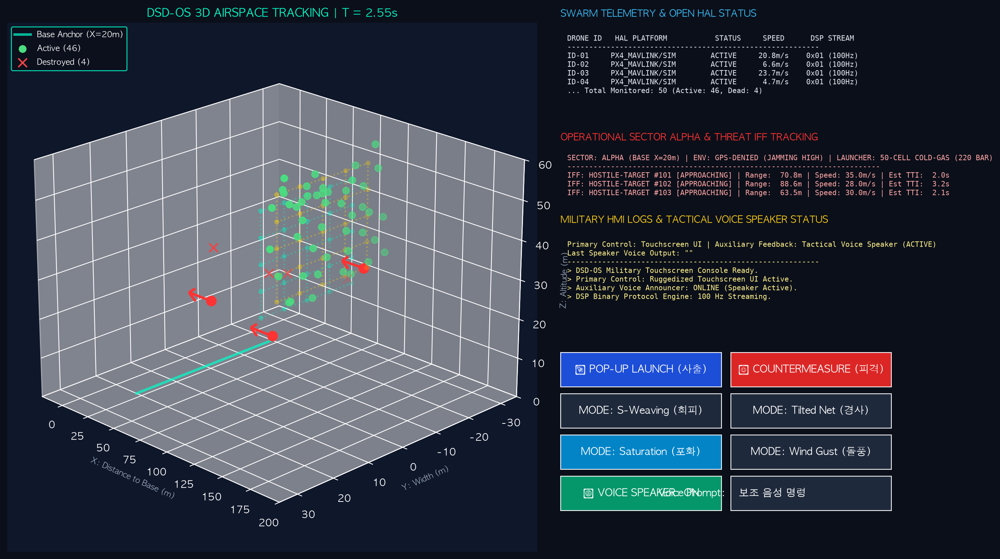

# DSD-OS Tactical C2 Management Console Operator Manual

> **DSD-OS 전술 지휘통제 관제 콘솔 운용 매뉴얼 및 시나리오 환경 가이드**
> **(DSD-OS Tactical C2 Console v1.0 Operational User Guide)**

---

## 📸 1. C2 관제 콘솔 인터페이스 및 환경 개요



### 📌 운용 전술 구역 및 기본 환경 파라미터 (Operational Environment)
- **방어 운용 섹터**: `SECTOR ALPHA (BASE DEFENSE ANCHOR X = 20.0m)`
- **전파 및 위성 환경**: `GPS-DENIED MODE` (100 Hz UWB 상대 거리 메쉬 독립 운용)
- **발사대 포대 사양**: 50셀 모듈식 콜드 가스 공압 사출 카세트 (사출 공압: 220 BAR, 사출 속도 $V_{eject} \ge 20\text{m/s}$)
- **피적 아군/적군 수신 위협 (IFF)**: `HOSTILE CRIMSON-1 (CRUISE MISSILE) & KAMIKAZE UAS`

---

## 🎛️ 2. 콘솔 4대 전문 패널 기능 명세 (Console Panel Specification)

```
+------------------------------------+------------------------------------+
| 1. 3D AIRSPACE TRACKING            | 2. SWARM TELEMETRY & OPEN HAL      |
|    (3D 전장 관제 대형 화면)        |    (드론 ID, HAL 플랫폼, 100Hz DSP) |
|                                    +------------------------------------+
|                                    | 3. OPERATIONAL SECTOR & THREAT IFF |
|                                    |    (위협 IFF, 잔여 거리, Est TTI)  |
|                                    +------------------------------------+
|                                    | 4. MILITARY HMI & VOICE SPEAKER    |
|                                    |    (로컬 AI 지연ms, 음성 스피커)   |
|                                    +------------------------------------+
|                                    | 5. [RUGGEDIZED TOUCHSCREEN BUTTONS]|
|                                    | [🚀 POP-UP LAUNCH] [⚡ COUNTERMEASURE] |
|                                    | [MODE A/B/C/D] [🔊 VOICE SPEAKER]  |
+------------------------------------+------------------------------------+
```

### [패널 1] 3D Airspace Tracking (좌측 3D 전장 관제 화면)
- 방어 기지 중심 축($X=20m$) 기준 3차원 공중 배리어 장막 노드(cyan/gold), 드론 위치(녹색), 적 침투체 궤적(빨간색 Quiver 화살표) 실시간 가시화.
- 마우스 좌클릭 드래그 시 3D 각도 회전, 우클릭 드래그 시 3D 영역 확대/축소.

### [패널 2] Swarm Telemetry & Open HAL (우상단 텔레메트리 표)
- 50대 드론의 ID별 3D 위치, 속도(m/s), 이종 비행제어기 HAL 이식 상태(`PX4_MAVLINK/SIM`), DSP 패킷 스트리밍 상태 모니터링.

### [패널 3] Operational Sector & Threat IFF Tracking (우중단 피대 위협 트래킹)
- 적 침투체(Target #101)의 피아식별(IFF) 정보, 진입 속도, 방어선까지의 잔여 거리(Range) 및 요격 예상 시간(Est TTI) 실시간 산출.

### [패널 4] Military HMI & Voice Speaker Status (우하단 HMI & 로그)
- 로컬 AI 연산 지연시간(ms), UWB 메쉬 상태, 전술 음성 스피커 안내 상태(`ACTIVE/DISABLED`) 및 최근 음성 멘트 로그 출력.

---

## 🎛️ 3. 터치스크린 물리 조작 & 보조 음성 채널 가이드

전장 환경의 100% 명확성 및 오작동 방지를 위해 HMI 채널이 2단계로 이원화되어 있습니다.

```
주 통제 채널 (Primary Control) ----> 터치스크린 물리 버튼 (100% 기계적 확정 실행)
보조 피드백 채널 (Auxiliary Guidance) -> 전술 음성 스피커 안내 (TTS Voice Alerts)
```

| 터치스크린 버튼 명칭 | 기능 설명 | 전술 음성 스피커 멘트 |
| :--- | :--- | :--- |
| **`🚀 POP-UP LAUNCH`** | 지상 사출 튜브 공압 팝업 및 3D 장막 형성 개시 | *"팝업 출격 개시. 드론 50대 전개."* |
| **`⚡ COUNTERMEASURE`** | 적 사격에 의한 드론 4대 손실 및 50ms Self-Healing 복구 테스트 | *"드론 4대 피격. 장막 재배치 완료."* |
| **`MODE: S-Weaving`** | S-곡선 회피 침투체 대응 모드로 전개 전환 | *"S곡선 침투 대응 모드."* |
| **`MODE: Tilted Net`** | 20도 Pitch/Yaw 경사 각도 배리어 모드로 전환 | *"경사 배리어 모드."* |
| **`MODE: Saturation`** | 3방향 다수 포화 공격 대응 모드로 전환 | *"포화 공격 대응 모드."* |
| **`MODE: Wind Gust`** | 실시간 돌풍 외란 환경 방어 모드로 전환 | *"돌풍 외란 방어 모드."* |
| **`🔊 VOICE SPEAKER`** | 전술 음성 스피커 안내 켜기/끄기 토글 | *"전술 음성 스피커 안내 시스템이 활성화되었습니다."* |

---

## 🎯 4. 전술 운용 시나리오 가이드 (Operational Scenarios)

### 시나리오 A: Weaving Threat (S-곡선 회피 드론 대응)
- **적 궤적**: 진입 속도 $28\text{m/s}$, 진폭 $12\text{m}$ S-곡선 회피 기동 자폭 드론
- **방어 대응**: 2중 지그재그 다층 공중 장막(Dual-Layer Staggered Net) 자동 형성을 통한 100% 요격

### 시나리오 B: Tilted Barrier (경사 미사일 요격)
- **적 궤적**: 고속 $38\text{m/s}$ 경사 각도 진입 순항 미사일
- **방어 대응**: Pitch $20^\circ$, Yaw $15^\circ$ 경사 배리어 구도로 장막 면을 실시간 기울여 대응

### 시나리오 C: Saturation Attack (다수 포화 공격 대응)
- **적 궤적**: 3방향 동시 진입 다수 위협 포화 공격
- **방어 대응**: 로컬 AI 제어기($2.83\text{ms}$) 기반 무작위 피격 후 $50\text{ms}$ 구멍 난 장막 Self-Healing 자동 복구

---

## 💻 5. 구동 및 시연 방법

터미널에서 아래 명령어를 실행하여 C2 관제 콘솔을 구동합니다:

```bash
.venv/bin/python main_demo.py --scenario saturation
```
