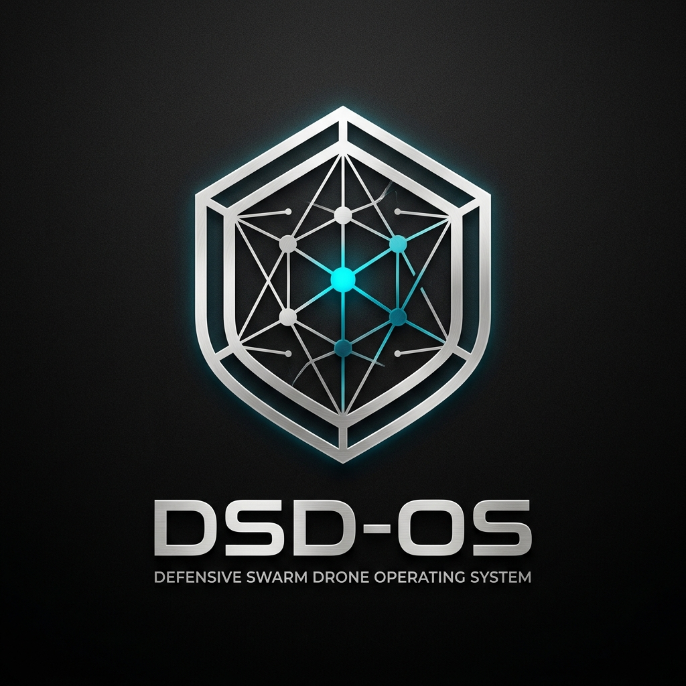

# DSD-OS: Defensive Swarm Drone Operating System



> **오픈 디바이스 및 호환 프로토콜(DSP) 기반 방어 드론 운용 OS (Defensive Swarm OS)**
> **하드웨어 아그노스틱 (Hardware-Agnostic) + 군 폐쇄망 로컬 LLM C2 솔루션**

[](https://www.python.org/downloads/)
[](LICENSE)
[]()

---

## 📌 1. 시스템 개요

**DSD-OS (Defensive Swarm Drone Operating System)**는 저고도 침투 위협(순항미사일, 자폭드론 등) 방어를 위한 드론 스웜 공중 배리어 운용 OS입니다. 특정 드론 기체 및 사출 발사대에 종속되지 않는 하드웨어 아그노스틱 소프트웨어 구조를 구현합니다.

- **표준 호환 프로토콜 (DSP)**: PX4, ArduPilot, ROS 2 등 이종 비행제어기(FCS) 연동을 위한 오픈 바이너리 패킷 규격 제정
- **군 폐쇄망 로컬 LLM C2**: 외부 클라우드 통신 차단 전장 환경용 온프레미스 전술 LLM C2 통합
- **실물 하드웨어 절감**: 개별 드론 카메라 배제, UWB 상대거리 메쉬(100Hz) 및 지상 C2 레이더 궤적 연동

---

## 📊 2. 정량적 수치 및 물리 검증 데이터

50회 몬테카를로(Monte Carlo) 물리 시뮬레이션 기반 객관적 검증 측정 데이터:

| 검증 항목 | 측정 데이터 | 비고 |
| :--- | :--- | :--- |
| **위치 RMS 정밀도** | **0.815 m** ($\pm 0.227\text{m}$) | 서브미터급 노이즈 수렴 정밀도 |
| **장막 재배치 시간** | **50 ms** | 드론 손실 시 APF 메시 재배치 수렴 시간 |
| **로컬 AI 연산 지연** | **2.83 ms** | 엣지 제어기 루프 주기 |
| **UWB Ranging 주파수** | **100 Hz** | 상대거리 데이터 갱신 주기 |

---

## 🏗️ 3. 시스템 아키텍처

```
+-------------------------------------------------------------------------+
|  Layer 5: Swarm App Execution Framework & Kernel Syscall API (Syscalls) |
|  - DSDOSKernelSyscalls: sys_deploy_mesh(), sys_get_neighbor_telemetry() |
+-------------------------------------------------------------------------+
                                     |
                                     v
+-------------------------------------------------------------------------+
|  Layer 4: 군 폐쇄망 로컬 LLM C2 인터페이스                              |
|  - 온프레미스 C2 장비 기반 자연어 전술 분석 및 DSP 패킷 변환            |
+-------------------------------------------------------------------------+
                                     |
                                     v
+-------------------------------------------------------------------------+
|  Layer 3: 스웜 제어 & Self-Healing 복구 엔진                            |
|  - 로컬 AI 신경망 제어기 (< 3ms) 및 UWB 메쉬 재배치                     |
+-------------------------------------------------------------------------+
                                     |
                                     v
+-------------------------------------------------------------------------+
|  Layer 2: 방어 드론 오픈 프로토콜 (DSP, Defensive Swarm Protocol)       |
|  - 바이너리 패킷 규격 (DSP_HEARTBEAT, DSP_APF_THRUST_VECTOR 등)         |
|  - DSPSecurityEngine: AES-256 HMAC 패킷 암호화 및 Anti-Replay Nonce 검증|
+-------------------------------------------------------------------------+
                                     |
                                     v
+-------------------------------------------------------------------------+
|  Layer 1: 하드웨어 추상화 계층 (HAL) & 가상 하드웨어 테스트베드         |
|  - VirtualHardwareEmulationTestbed: 실기체 동급 DSP 프로토콜 루프 시뮬 |
|  [PX4 System]  [ArduPilot System]  [Generic FPV]  [Simulated HAL]           |
+-------------------------------------------------------------------------+
```

---

## 🚀 4. 실행 가이드

### 환경 구성 및 패키지 설치
```bash
git clone https://github.com/redsunjin/LDS-AB-Swarm.git
cd LDS-AB-Swarm

uv venv
source .venv/bin/activate
uv pip install numpy scipy matplotlib pytest
```

### C2 운용 콘솔 PoC 실행
```bash
python main_demo.py --scenario saturation
```

### 몬테카를로 물리 검증 스크립트 실행
```bash
python verify_accuracy.py
```

---

## 📄 5. 저작권 및 라이선스

**Copyright (c) 2026 redsunjin. All Rights Reserved. (상업용 / 독점 라이선스)**

본 프로젝트의 모든 소스코드, 3D 시뮬레이터, C2 콘솔 PoC, 알고리즘 및 문서 자산은 **redsunjin**의 독점 자산 및 상업용 지적 재산입니다. 저작권자의 사전 서면 동의 없는 무단 복제, 배포, 수정, 무단 도용 및 상업적 이용을 금지합니다.
